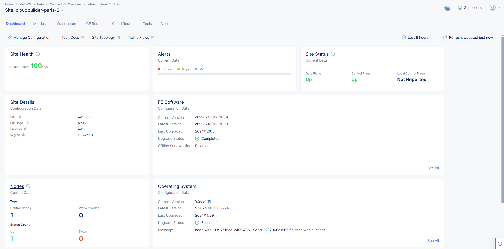
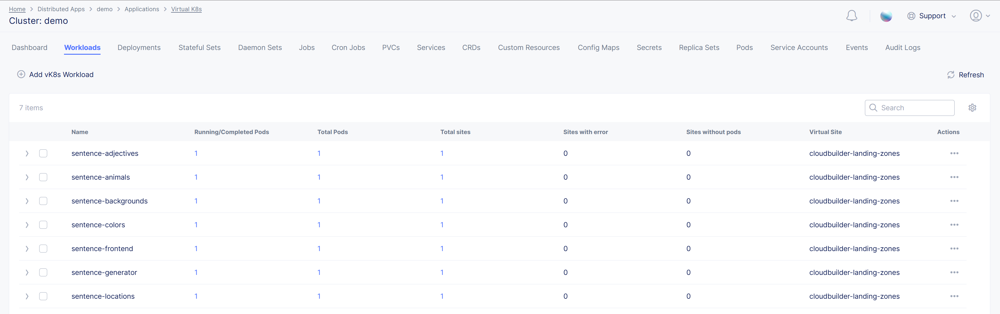
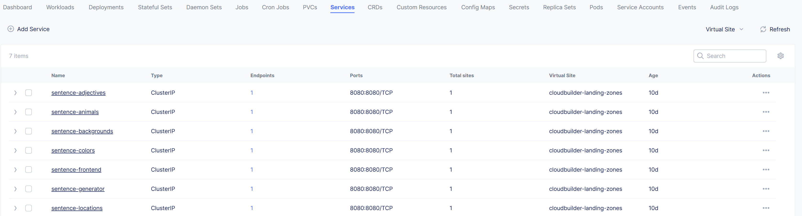
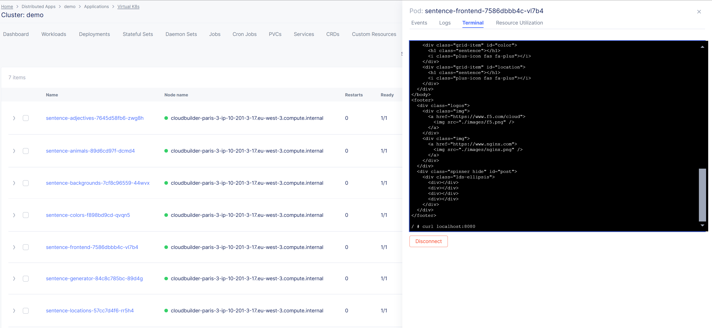
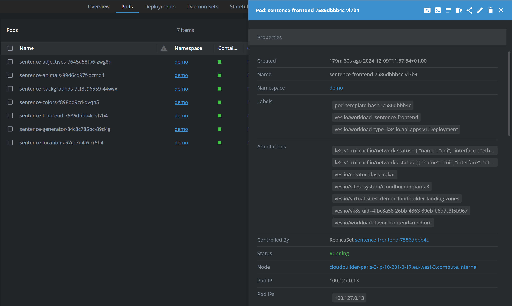
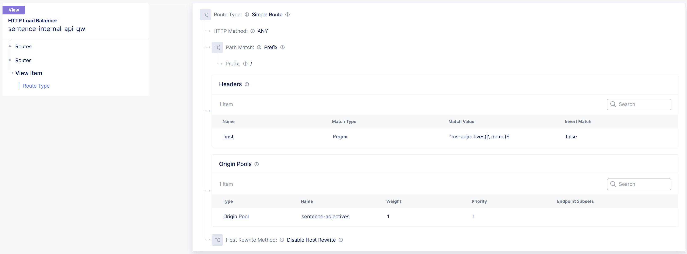
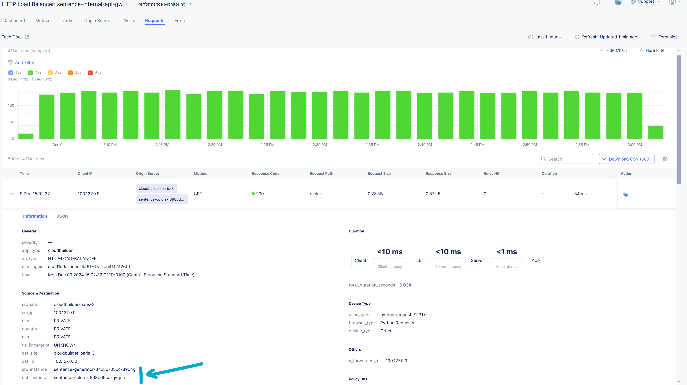
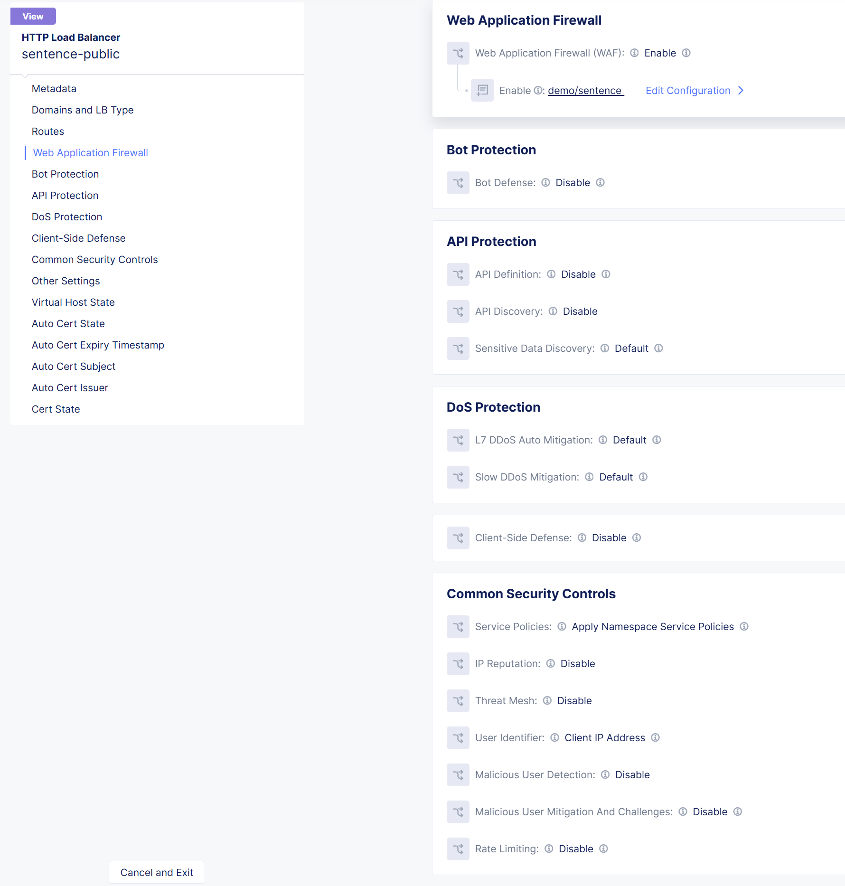

Publish Sentence app in vK8S
####################################################################

.. raw:: html

    

.. contents:: Contents
    :local:

F5 Distributed Cloud (XC) is a ridiculously easy platform to host and publish secure containerized applications.
This repo is a simple example on how to do that in few API calls.

App design
*****************************************

``Sentence`` is micro-services based application, composed of the following services:
    - 4 x ``word`` type (adjective, location, animal, color)
    - ``generator``
    - ``frontend``
    - ``background``

The goal of this app is to generate a sentence:
    - each ``word`` returns a random word
    - ``generator`` makes one call to each ``word`` service
    - ``frontend`` calls ``generator`` and returns the full sentence in a Web page
    - ``background`` return a random background to the browser

XC vK8S cluster
*****************************************
Through the XC Console (GUI or API), your virtual Kubernetes (vK8S) cluster is deployed on XC nodes,
named Customer Edges (CE).
For example: 1 Customer Edge of 1 node in AWS

XC Workloads
*****************************************
Once your App component images are built and uploaded to your Private Registry,
app workloads are deployed in your vK8S.

Each workloads publish an internal vK8S service

For troubleshooting, the workload can be accessed through a shell via the XC console

or you can use your own IDE by uploading your vK8S Kubeconfig file

XC internal API GW
*****************************************

A XC Load-Balancer allows you to manage the publication of your internal APIs and route them to the related service

The access logs or request logs are available in the XC Console, with a high level of details

XC public exposition
*****************************************

A XC Load-Balancer allows you to manage the publication of your frontend Web server,
TLS certificate and DNS managed by F5,
and with a security policy.

The security logs are available in the XC Console, with an AI assistant to help you to explain the cause and the next steps to do

.. image:: ./XC-LB-log_security.png
   :align: center
   :width: 1000
   :alt: Public Web - log

Automation
*****************************************
The ``playbooks`` directory contains the Ansible role used to deploys the Sentence app

.. code-block:: yaml

        extra_app:
          components:
            - name: generator
              location: /api/sentence
              repo: 'https://gitlab.com/sentence-app/generator.git'
              version: development
              env:
                - name: NAMESPACE
                  value: demo
                - name: PREFIX
                  value: ms
            - name: frontend
              location: /
              repo: 'https://gitlab.com/sentence-app/frontend.git'
              version: main
            - name: adjectives
              location: /adjectives
              repo: 'https://gitlab.com/sentence-app/adjectives.git'
              version: main
            - name: animals
              location: /animals
              repo: 'https://gitlab.com/sentence-app/animals.git'
              version: main
            - name: backgrounds
              location: /backgrounds
              repo: 'https://gitlab.com/sentence-app/backgrounds.git'
              version: main
            - name: colors
              location: /colors
              repo: 'https://gitlab.com/sentence-app/colors.git'
              version: main
            - name: locations
              location: /locations
              repo: 'https://gitlab.com/sentence-app/locations.git'
              version: main
          domain: f5xcdev.com
          name: sentence
        extra_jumphost:
          name: jumphost
        extra_namespace: demo
        extra_owner_email: my-emain@gg.com
        extra_volterra:
          tenant:
            full: my-xc-tenant-name-long
            short: my-xc-tenant-name-short
          token: my-xc-tenant-token
        extra_volterra_site_id: 3

